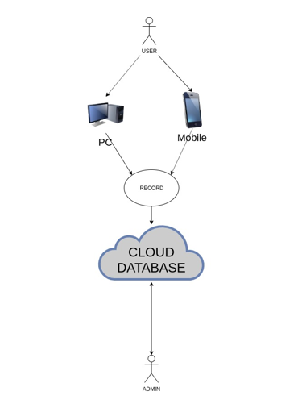
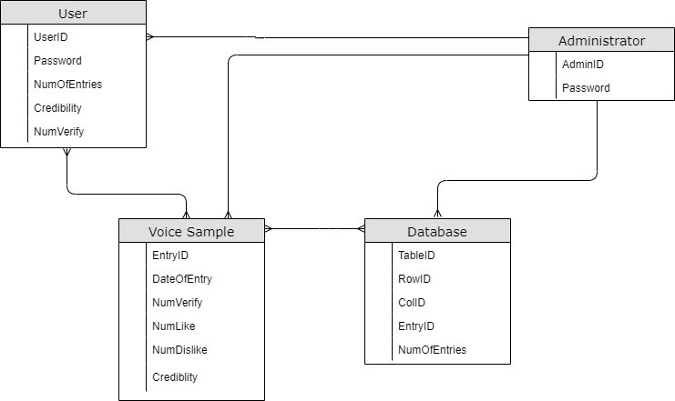
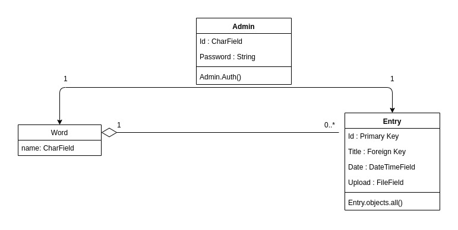

# Proposal
# Crowdsourcing For Words (Bahasa Malaysia)

## Team Member
1. Ahmad Hafidz Bin Muhd Mawardi  
2. Syahmirullah Bin Sulaiman  
3. Wan Ahmad Aiman Bin Wan Mohamad Noor

---

## Project Overview
Our project’s main aim is to collect voice samples of certain words spoken in Malay, mainly for the use of speech recognition system development. We decided to achieve this aim through crowd-sourcing, enabling us to obtain a variety of samples with different voices, accents, pitch and more. 

We plan to create a website to accommodate our projects need and to ease others to access and participate in the data collection. Basically, our website will allow anyone to give a voice sample of the given words, which will then be verified by the administrators and other users. Users can regularly check-in and help verify the new entries of voice samples anytime. 

These voice samples will then be stored in our database, created using Django, where the administrators will be able access the data and also share the data to whoever requests it. 

---

## System Architecture  

---

## Entity-Relationship Diagram

---

## Class Diagram

